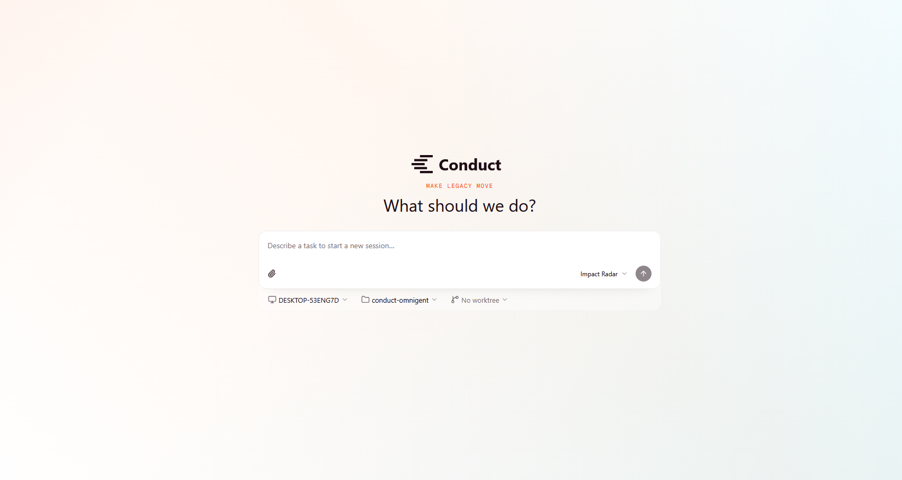
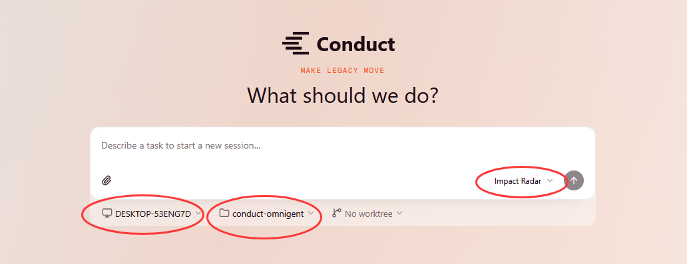
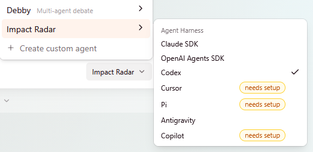
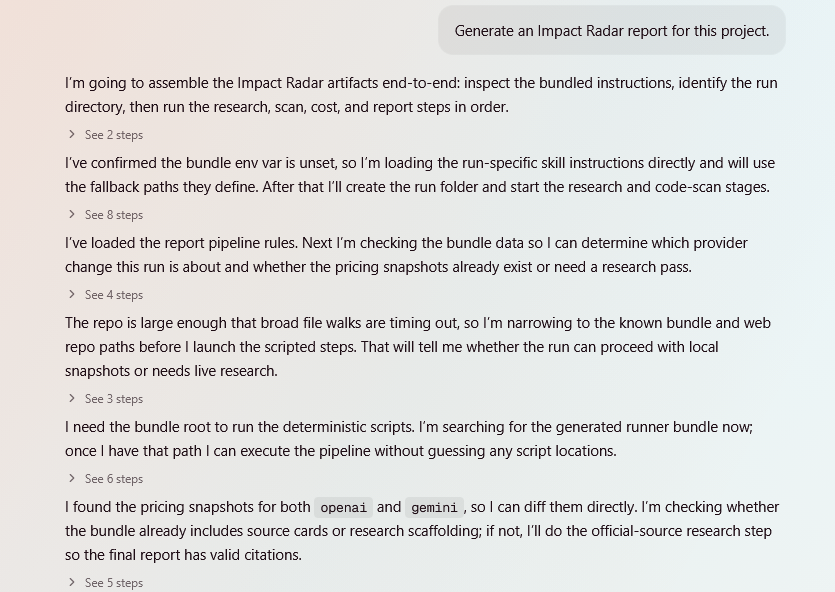
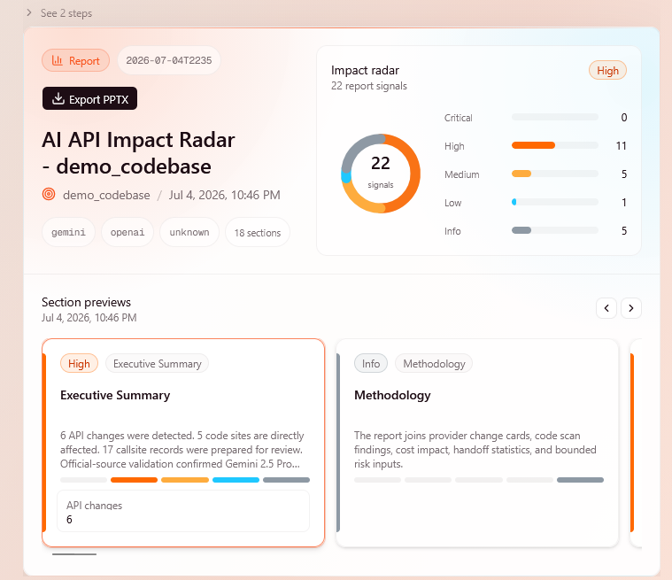
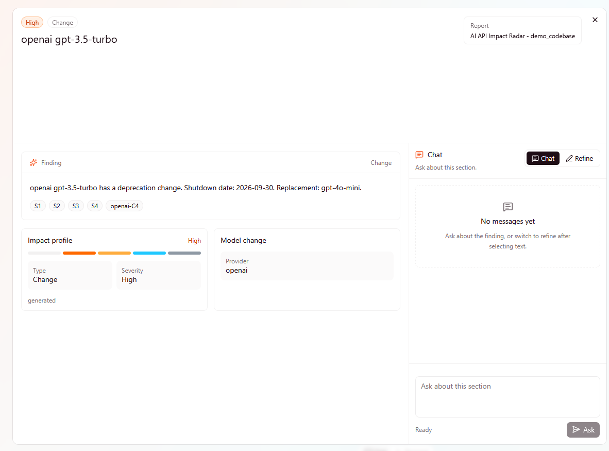
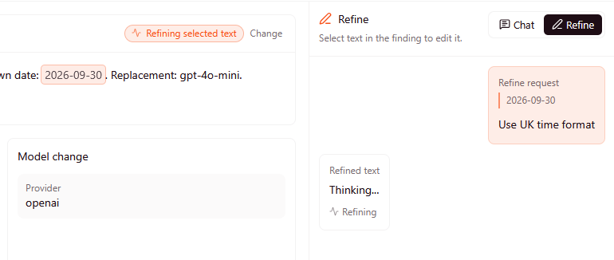
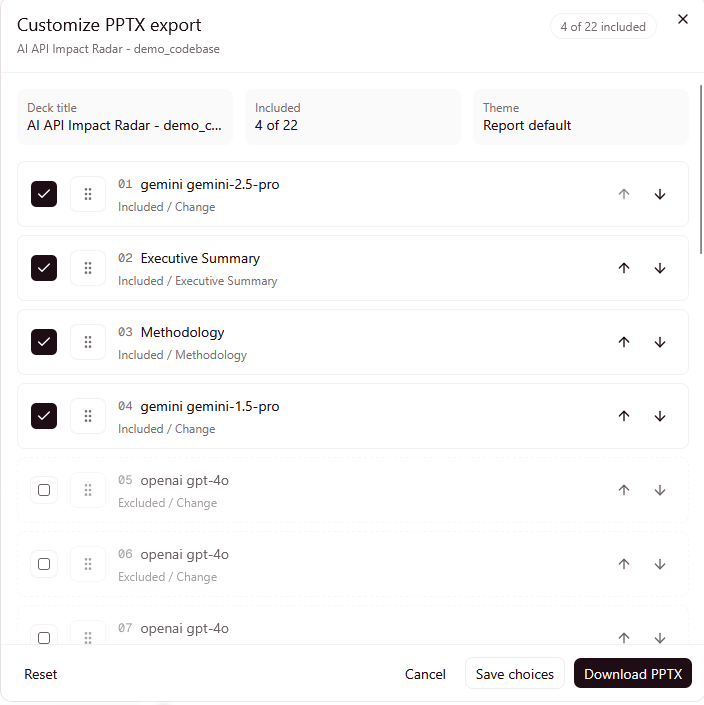

<p align="center">
  
</p>

# Conduct Impact Radar

Conduct Impact Radar is a web-based report workflow for scanning a project
directory and generating an AI API impact report. It is built on Omnigent, but
this README is focused on the Impact Radar path only.

Use the remote server when possible. The remote app hosts the web UI and
coordination server. Your own machine connects as a host, and the runner reads
the project directory from your local filesystem.

## Start Here

Use this top-level flow for the hosted Conduct server.

Remote app:

```text
https://niox1337-conduct.hf.space
```

### 1. Download This Repo

Run the local host from this fork so your machine uses the same Impact Radar
bundle as the deployed app.

```bash
git clone https://github.com/UK-AI-Agent-Hackathon-Ep-5/conduct-omnigent.git
cd conduct-omnigent
```

### 2. Set Up the Local Environment

Install the Python environment and dependencies:

```bash
uv venv --python 3.12
uv sync --extra all --extra dev
```

On Windows, run these commands inside WSL Ubuntu.

### 3. Set Up API And Models

Configure the model or CLI credentials that your local host will use when
Impact Radar runs.

```bash
uv run omnigent setup
```

At minimum, set up access for the model you plan to choose in the Impact Radar
model picker. If you choose a CLI-backed runner, sign in to that CLI on the same
machine that will run `omnigent host`.

### 4. Sign Up Or Get Access

Open the remote app in a normal browser tab:

```text
https://niox1337-conduct.hf.space
```

Use one of these invite links if registration asks for an invite:

- https://niox1337-conduct.hf.space/register?invite=ljH6tmZaWkUZqqnl1y43VMGYMK1QLqhptTzmA0IBDEY
- https://niox1337-conduct.hf.space/register?invite=UndayEH1bmZK6Piu2bKhOwkKA_ZHEkqTv8Ixe_BGRUE
- https://niox1337-conduct.hf.space/register?invite=DgLSSrMS3SmRamRUXXNulLshwIrov5rn0CR1kwrtaAM
- https://niox1337-conduct.hf.space/register?invite=c_4DYjzL-iuoyUk9UVQF7w7pVoYybGAegY15wdtKnrk
- https://niox1337-conduct.hf.space/register?invite=-reJsDzn-Tt8vrxWvItynK4UYRt_3A5WmnSp3ee8XMw

These invite links are valid for 72 hours. Reach out to
contact@zhixiangfeng.com for more invite links.

If the server is fresh, create the first admin account. If an admin already
exists, ask the admin for an invite link or an account.

### 5. Log In

Log in with your username and password. After login, you should see the Conduct
landing chat.

### 6. Connect Your Machine

In the repo checkout, log in to the remote server:

```bash
uv run omnigent login https://niox1337-conduct.hf.space
```

Then keep the host process running:

```bash
uv run omnigent host --server https://niox1337-conduct.hf.space
```

When the host is online, use the web UI to select your host, project directory,
Impact Radar agent, and model.

## What The Flow Looks Like

The screenshots below show the main Impact Radar path from the landing chat to
the final report tools.



Landing chat screen. Start from the main composer after logging in.



Select the host, project directory, and **Impact Radar** agent before sending
the first message.



Choose the model or harness for Impact Radar. The connected host must have the
matching credential or CLI login.



The report generation process streams progress while the agent researches,
scans, and builds the report.



The completed report appears as a rendered Impact Radar preview with section
cards and export controls.



Open a section to inspect the full detail and ask questions in the modal chat.



Highlight report text in the section modal to ask about it or refine the
selected text in place.



Use the PPTX export modal to choose, reorder, and download report sections.

## Local Use

Use local mode when you do not need other people to reach the server.

### 1. Download This Repo

```bash
git clone https://github.com/UK-AI-Agent-Hackathon-Ep-5/conduct-omnigent.git
cd conduct-omnigent
```

### 2. Set Up the Local Environment

```bash
uv venv --python 3.12
uv sync --extra all --extra dev
```

### 3. Set Up API And Models

```bash
uv run omnigent setup
```

Configure the provider, API key, or CLI login for the model you want to use
before starting an Impact Radar run.

### 4. Start the Server

```bash
uv run omnigent server start
```

Open:

```text
http://localhost:6767
```

### 5. Connect the Host

In a second terminal:

```bash
uv run omnigent host --server http://localhost:6767
```

Then follow the same web UI steps:

1. Create or log in to your account.
2. Start a new chat.
3. Select your project directory.
4. Select **Impact Radar**.
5. Select a model.
6. Send `Generate an Impact Radar report for this project.`

## Let Other Users Use the App

Other users need accounts and their own connected hosts.

Admin flow:

1. Log in as an admin.
2. Open the members or admin area.
3. Invite the user or create an account for them.
4. Send them the app URL.

User flow:

1. Download this repo.
2. Run `uv sync --extra all --extra dev`.
3. Log in to the remote server with `uv run omnigent login`.
4. Run `uv run omnigent host --server`.
5. Start an Impact Radar chat in the browser.

Do not share the admin password. Each user should have their own account, and
each user should connect their own machine as a host.

## Troubleshooting

### The Login Page Says the User Does Not Exist

Use the username that was created on first boot. In containers, the first
admin may be `root` unless `OMNIGENT_ACCOUNTS_INIT_ADMIN_USERNAME` was set
before the first boot.

### No Host Is Available

The host terminal is not connected. Start it again:

```bash
uv run omnigent host --server https://niox1337-conduct.hf.space
```

### The Project Directory Is Missing

The server only sees directories through the connected host. Check that the
host is running on the same machine where the project exists.

### Impact Radar Is Missing From the Agent Picker

Refresh the page. If it is still missing, check the server logs for:

```text
Registered built-in impact-radar agent
```

### The Report Does Not Render

Ask the agent to generate the report again with the short prompt:

```text
Generate an Impact Radar report for this project.
```

If it returns raw JSON, copy the visible output and report the exact text that
appears before `REPORT_OUTPUT`.
